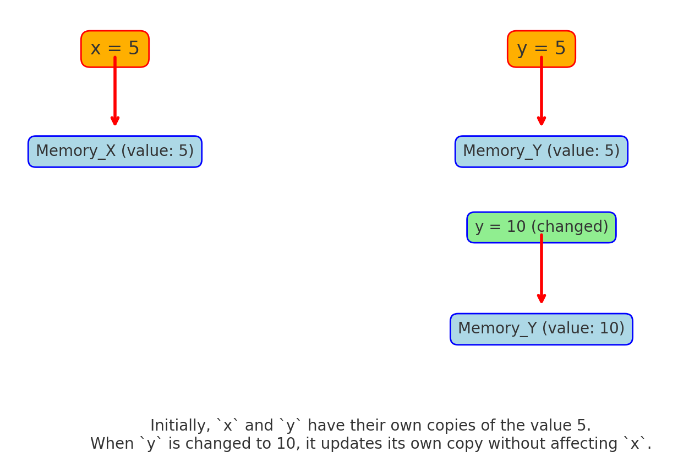

# Understanding Primitive Types in JavaScript

Before moving to the topic of deep and shallow copy, we firslty need to understand how the varibles behave when they are being assinged to another.

When working with variables in JavaScript, the way data is copied depends on whether it's a **primitive type** or a **reference type**. The process of copying lies between these two categories, and understanding this distinction helps avoid common pitfalls in coding.

## Primitive vs. Reference Types

- **Primitive Types**: When you assign a primitive, it copies the value, creating two separate, independent variables.
- **Reference Types**: When you assign objects, arrays, or functions, it copies the reference, not the actual value. This means if you modify the object through one variable, it will affect the other because they both point to the same object in memory.

<br>

# (Example of Primitive Types):

```javascript
let a = 5;   // `a` is a number (primitive type)
let b = a;   // `b` is assigned the value of `a`

console.log(a); // Output: 5
console.log(b); // Output: 5

// Changing the value of `b`
b = 10;

console.log(a); // Output: 5 (unchanged)
console.log(b); // Output: 10
```

### Visual Explanation of Primitive Types in JavaScript


### Primitive types are copied by value, so each variable has its own copy.



### So Changing one won’t affect the other.

let's Breakdown:

1. **Initial Assignment:**
   - `a` is `5` stored in `Memory_A`.
   - `b` is set to `a`, getting a **copy** of `5` in `Memory_B`.

2. **Independent Memory:**
   - `a` and `b` have **separate** memory locations.
   - Changing `b` does **not** affect `a`.

3. **Modifying `b`:**
   - When `b` changes to `10`, only `Memory_B` updates.
   - `a` remains `5` in `Memory_A`.

**Primitive types** are **copied by value**, so each variable keeps its **own copy**.


# (Example of Reference Type):

```javascript
let obj1 = { name: "Hashim" };
let obj2 = obj1;

console.log(obj1); // Output: { name: "Hashim" }
console.log(obj2); // Output: { name: "Hashim" }

// Changing the object through `obj2`
obj2.name = "Muhammad Hashim";

console.log(obj1); // Output: { name: "Muhammad Hashim" }
console.log(obj2); // Output: { name: "Muhammad Hashim" }
```

**Explanation:**  
In this case, `obj1` is an object, which is a **reference type**. When `obj2` is assigned `obj1`, it does not create a new copy. Instead, `obj2` gets a reference to the same object. This means any changes made through `obj2` will also reflect in `obj1` because they both point to the same object in memory.


### Code Example:

```javascript
let user = {
  name: "Ishaq",
  age: 20,
  city: "Karachi",
  address: {
    area: "Gulburg",
    street: 24,
    houseno: 205,
  },
};

// Assigning `user` to `user1`
let user1 = user;

// Modifying the `user1` object
user1.address.area = "Clifton";

console.log(user.address.area); // Output: "Clifton"
console.log(user1.address.area); // Output: "Clifton"
```
<br>

## Visual Explanation of Reference Types in JavaScript

The image demonstrates how reference types work in JavaScript, showing that when you assign one object to another, 


<br> 

### Both variables end up pointing to the same memory location.

<br> 


### Key Points:

1. **`user` and `user1` Variables:**
   - Both `user` and `user1` point to the **same memory address**, which stores the actual object data.
   - When you assign `user` to `user1`, it doesn’t create a new copy. `user1` just receives the **reference** to the same object.

2. **Shared Reference:**
   - Both variables are **linked** to the same object. So, any change made via `user1` will also show when accessing `user`.
   - `user` and `user1` act as different labels pointing to the same data.

3. **Why This Happens:**
   - Objects, arrays, and functions in JavaScript are **reference types**, stored as references in memory.
   - Assigning one reference type to another variable **copies the reference**, not the data.
   - This is why both variables access the **same memory location**.


<br>

# Deep Copy vs Shallow Copy in JavaScript

## Introduction

When working with objects and arrays in JavaScript, understanding the difference between deep copy and shallow copy is crucial. These concepts determine how data structures are duplicated and how changes to copies affect the original data.

### Shallow Copy

A **shallow copy** of an object or array creates a new object/array with references to the same elements as the original. This means that if the original object contains other objects (nested objects), the shallow copy will only duplicate the references to these nested objects, not the objects themselves.

#### Shallow Copy Methods

Some common methods to create shallow copies in JavaScript include:

- `Object.assign()`
- The spread operator (`...`)

#### Example of Shallow Copy using `obejct.assign()`

```javascript
// Creating an object and shallow copying in one line
let shallowCopy = Object.assign({}, { name: "Ali", address: { city: "Islamabad", country: "Pakistan" } });

// Modify the nested object
shallowCopy.address.city = "Lahore";

console.log(shallowCopy.address.city); // Output: "Lahore"
```

This method is short and direct, allowing you to use Object.assign in fewer lines. However, when handling nested objects, it still creates a shallow copy.

```javascript
// Creating an object
let originalObject = {
  name: "Ali",
  address: {
    city: "Islamabad",
    country: "Pakistan"
  }
};

// Shallow copying the object using Object.assign
let shallowCopy = Object.assign({}, originalObject);

// Modifying the nested object in the shallow copy
shallowCopy.address.city = "Lahore";

console.log(originalObject.address.city); // Output: "Lahore"
```

#### Simplified Version.

```javascript
let originalObject = {
  name: "Ali",
  address: {
    city: "Islamabad",
    country: "Pakistan"
  }
};

// Create an empty object
let emptyObject = {};

// Shallow copy using Object.assign
let shallowCopy = Object.assign(emptyObject, originalObject);

// Modifying the nested object in the shallow copy
shallowCopy.address.city = "Lahore";

console.log(originalObject.address.city); // Output: "Lahore"

```
In this example, modifying the `city` property in `shallowCopy` also modifies the `city` in `originalObject` because both objects share the same reference to the `address` object.


#### Example Using Spread Operator.

```javascript
let originalUser = {
  username: "johnDoe",
  preferences: {
    theme: "dark",
    language: "English"
  }
};

// Shallow copy using spread operator
let copiedUser = { ...originalUser };

// Modifying the nested object in the copied object
copiedUser.preferences.theme = "light";

console.log(originalUser.preferences.theme); // Output: "light"

```


### Deep Copy

A **deep copy** creates a new object or array with copies of all the elements, including nested objects and arrays. This means that changes made to the deep copy do not affect the original object or array.

#### Example of Deep Copy

```javascript
// Creating an object
let originalObject = {
  name: "Ahmed",
  address: {
    city: "Karachi",
    country: "Pakistan"
  }
};

// Deep copying the object using JSON.parse(JSON.stringify())
let deepCopy = JSON.parse(JSON.stringify(originalObject));

// Modifying the nested object in the deep copy
deepCopy.address.city = "Quetta";

console.log(originalObject.address.city); // Output: "Karachi"
```

In this example, modifying the `city` property in `deepCopy` does not affect the `originalObject`, because `deepCopy` contains a complete copy of the `address` object, not just a reference.

#### Deep Copy Methods

To perform a deep copy in JavaScript, you can use:

- `JSON.parse(JSON.stringify())` (simple objects and arrays)
- Libraries like Lodash (`_.cloneDeep`)

## Summary

- **Shallow Copy**: Copies only the references to nested objects, not the objects themselves.
- **Deep Copy**: Creates a full copy of the original object, including all nested objects.

<br>
<br>

 If you want to understand how nested objects behave differently in shallow copy vs deep copy, let's expand on that a bit.

# Nested Objects in Shallow Copy

When you create a shallow copy of an object that contains nested objects, the references to those nested objects are copied, not the objects themselves. This means both the original and the copied object will point to the same nested object.

#### Example: Shallow Copy with Nested Objects

```javascript
let originalObject = {
  name: "Ali",
  address: {
    city: "Islamabad",
    country: "Pakistan"
  },
  hobbies: ["Cricket", "Reading"]
};

// Shallow copying the object using the spread operator
let shallowCopy = { ...originalObject };

// Modifying the nested object in the shallow copy
shallowCopy.address.city = "Lahore";
shallowCopy.hobbies.push("Coding");

console.log(originalObject.address.city); // Output: "Lahore"
console.log(originalObject.hobbies);      // Output: ["Cricket", "Reading", "Coding"]
```

In this example, when we modify `shallowCopy.address.city`, the change is reflected in `originalObject.address.city` as well, because both the original and shallow copy share the same reference to the `address` object. Similarly, adding a new hobby in `shallowCopy.hobbies` also affects `originalObject.hobbies`.

But there is one deawback if you change a property of a nested object within a shallow copy, both the original object and the shallow copy will reflect that change. This happens because the shallow copy only creates a new reference to the nested object, not a new nested object itself.

```javascript
let originalObject = {
  name: "Ali",
  address: {
    city: "Islamabad",
    country: "Pakistan"
  }
};

// Creating a shallow copy using the spread operator
let shallowCopy = { ...originalObject };

// Modifying a property of the nested object in the shallow copy
shallowCopy.address.city = "Lahore";

// Logging the properties
console.log(originalObject.address.city); // Output: "Lahore"
console.log(shallowCopy.address.city);    // Output: "Lahore"
```
### Why Does This Happen?

This happens because the shallow copy does not create a new `address` object; it only copies the reference to the same `address` object from `originalObject`. Therefore, any modification to the `address` object in either `originalObject` or `shallowCopy` will affect both.


### Nested Objects in Deep Copy

When you create a deep copy of an object, all nested objects and arrays are copied as well. This means that the new object is completely independent of the original.

#### Example: Deep Copy with Nested Objects

```javascript
let originalObject = {
  name: "Ahmed",
  address: {
    city: "Karachi",
    country: "Pakistan"
  },
  hobbies: ["Football", "Movies"]
};

// Deep copying the object using JSON.parse(JSON.stringify())
let deepCopy = JSON.parse(JSON.stringify(originalObject));

// Modifying the nested object in the deep copy
deepCopy.address.city = "Quetta";
deepCopy.hobbies.push("Swimming");

console.log(originalObject.address.city); // Output: "Karachi"
console.log(originalObject.hobbies);      // Output: ["Football", "Movies"]
```

In this example, when we modify `deepCopy.address.city`, the change is **not** reflected in `originalObject.address.city`, and adding a new hobby to `deepCopy.hobbies` does not affect `originalObject.hobbies`. This is because `deepCopy` contains a full, independent copy of the original object, including all nested structures.

### Important Note on Deep Copy

While using `JSON.parse(JSON.stringify())` is a quick way to perform a deep copy, it has limitations:
- It does not copy functions, `undefined`, `NaN`, `Infinity`, or special objects like `Date` and `RegExp`.
- Circular references (when an object refers to itself) will cause an error.

For more complex objects or cases where you need to handle special data types, you might want to use a library like Lodash's `_.cloneDeep()`.


