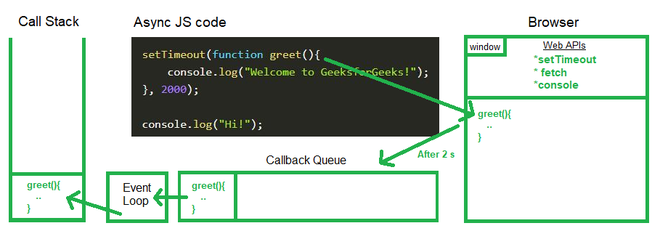

# Understanding Web APIs, Callback Queue, and Event Loop

## Introduction

In JavaScript, handling asynchronous tasks is an essential part of creating smooth and responsive web applications. The following three key components play a critical role in managing asynchronous behavior in the browser environment:

1. **Web APIs**
2. **Callback Queue**
3. **Event Loop**

Let’s explore each of these in detail.

## What are Web APIs?

Web APIs are features provided by the browser to handle tasks that the JavaScript engine itself cannot manage. These include:

- **setTimeout**: Schedules code execution after a specific time.

```javascript
// Example of using setTimeout Web API

console.log('Start');

setTimeout(() => {
    console.log('This message is shown after 2 seconds');
}, 2000);

console.log('End');
```


- **HTTP Requests**: Fetch data from the server using `fetch` or `XMLHttpRequest`.


```javascript
// Example of using fetch Web API to get data from a server

fetch('https://jsonplaceholder.typicode.com/posts/1')
    .then(response => response.json())
    .then(data => {
        console.log('Fetched Data:', data);
    })
    .catch(error => {
        console.error('Error fetching data:', error);
    });
```

- **DOM Events**: Handle user interactions like clicks, keypresses, etc.


```javascript
<!-- Example of using DOM Events Web API -->

<!DOCTYPE html>
<html lang="en">
<head>
    <meta charset="UTF-8">
    <title>DOM Events Example</title>
</head>
<body>
    <button id="clickButton">Click Me</button>

    <script>
        const button = document.getElementById('clickButton');
        button.addEventListener('click', () => {
            alert('Button was clicked!');
        });
    </script>
</body>
</html>

```

### Key Points:

- Web APIs work outside the JavaScript engine.
- They handle asynchronous operations like timers, network requests, or event listeners.
- Once the task is complete, the results are forwarded to the Callback Queue.

## Understanding Callback Queue

The Callback Queue is where callbacks from asynchronous tasks are stored after completion. These tasks are then queued up for execution by the Event Loop when the Call Stack is empty.

```javascript
// Example to demonstrate Callback Queue and Event Loop

console.log('Script Start');

setTimeout(() => {
    console.log('setTimeout callback');
}, 0);

Promise.resolve().then(() => {
    console.log('Promise callback');
});

console.log('Script End');

/*
Expected Output:
Script Start
Script End
Promise callback
setTimeout callback
*/
```


### How it Works:

1. Once a task like `setTimeout` or `fetch` completes, its callback is sent to the Callback Queue.
2. The Callback Queue waits for the Call Stack to become empty.
3. The Event Loop picks up tasks from the queue and sends them to the Call Stack for execution.

## What is the Event Loop?

The Event Loop is a mechanism that monitors the Call Stack and the Callback Queue. It ensures the smooth execution of asynchronous tasks.




### How it Works:

1. The Event Loop checks if the Call Stack is empty.
2. If the stack is empty, it moves the first task from the Callback Queue to the Call Stack.
3. This process continues, ensuring that all queued tasks are executed sequentially.

## Why are These Called Low-Level Mechanisms?

These mechanisms are called low-level because:

- They operate behind the scenes and are not directly visible in the browser interface.
- They interact closely with the browser’s core systems to manage JavaScript’s asynchronous behavior.
- They provide the backbone for smooth task execution in JavaScript.

## Conclusion

Understanding Web APIs, the Callback Queue, and the Event Loop is essential to mastering JavaScript’s asynchronous capabilities. These components work together to manage tasks efficiently, ensuring the smooth functioning of modern web applications.

